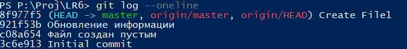
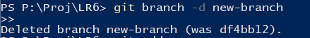

# LR6
Лабораторная работа №6

# Работа с GIT

## Клонирование локально репозиторий

## Добавление в локальный репозиторий новый созданный файл

## Добавление нового файла в локальный репозиторий

## Получение историй операций

## Получение последней операции

## Создание новой ветки

## Добавление нового файла в новую ветку

## Слияние веток

## Удаление ветки

## Изменение файлов

## Откат изменения

